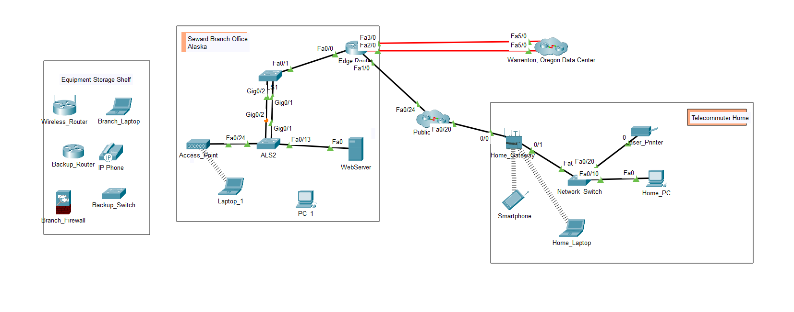

# Lab: Logical and Physical Mode Exploration

## Objective
Investigate the Packet Tracer interface, navigate the physical wiring closet, and establish connectivity between end devices and networking hardware.

## Topology


## Configuration Steps
To initialize the device and set the identity, the following commands were used on the Edge Router:

```ios
enable
configure terminal
hostname Edge_Router_Backup